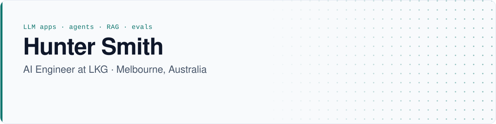
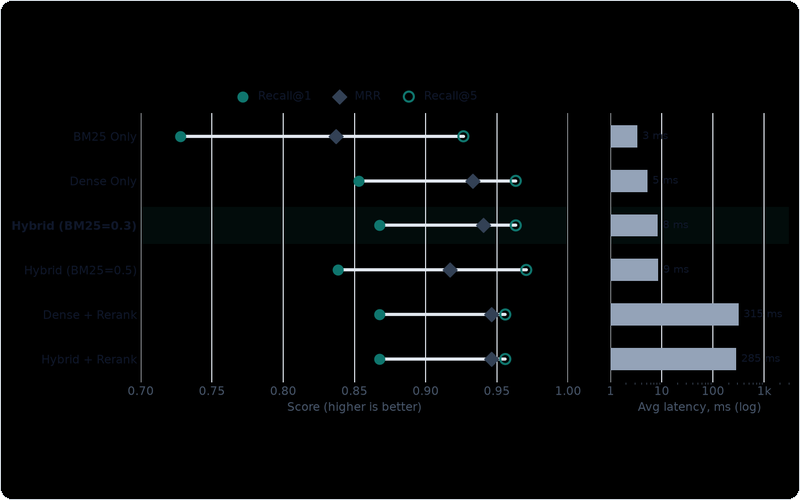
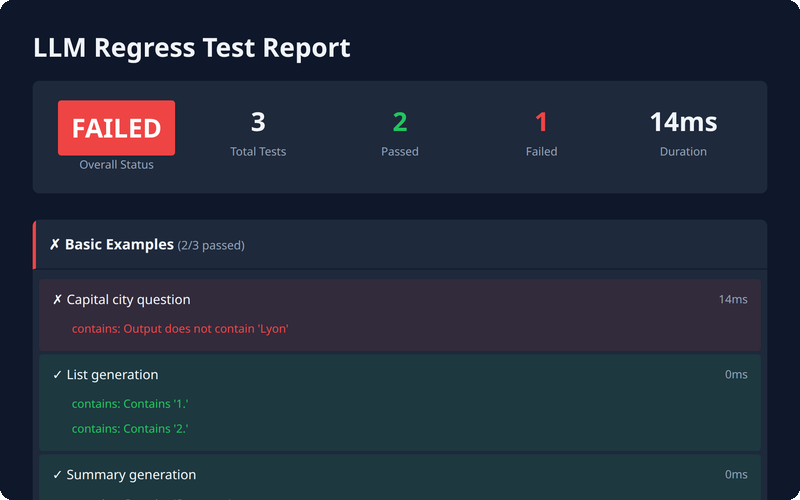
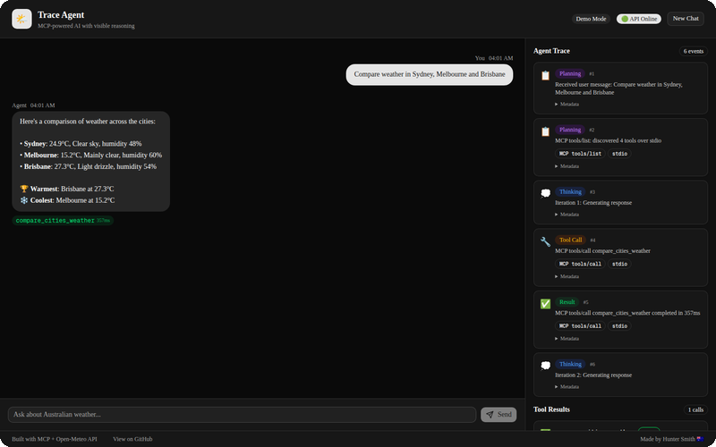
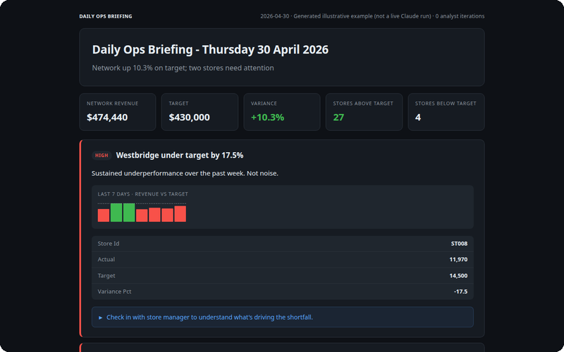

  <picture>
    <source media="(prefers-color-scheme: dark)" srcset="assets/banner-dark.svg">
    <source media="(prefers-color-scheme: light)" srcset="assets/banner-light.svg">
    
  </picture>

I build AI systems for operational problems: LLM agents, retrieval pipelines, and the evals and tests that show whether they work. Each project below has tests, CI on GitHub Actions, and a written Limitations section.

### Featured projects

<table>
<tr>
<td width="50%" valign="top">
  <a href="https://github.com/SmitHunter/rag-forge"><picture><source media="(prefers-color-scheme: dark)" srcset="assets/thumb-rag-forge-dark.png"><source media="(prefers-color-scheme: light)" srcset="assets/thumb-rag-forge-light.png"></picture></a> 
  <a href="https://github.com/SmitHunter/rag-forge"><b>rag-forge</b></a> 
  Measures chunking, hybrid retrieval and reranking on a 76-question eval set. 
  Python · FAISS · BM25 · SentenceTransformers · FastAPI
</td>
<td width="50%" valign="top">
   
  <a href="https://github.com/SmitHunter/llm-regress"><b>llm-regress</b></a> 
  YAML regression suites for prompts; <code>compare</code> fails CI on a regression. 
  Python · asyncio · GitHub Actions · LLM-as-judge
</td>
</tr>
<tr>
<td width="50%" valign="top">
   
  <a href="https://github.com/SmitHunter/trace-agent"><b>trace-agent</b></a> 
  MCP server and MCP-client agent; the UI traces every <code>tools/list</code> and <code>tools/call</code>. 
  Python · MCP · FastAPI · Next.js · Docker
</td>
<td width="50%" valign="top">
   
  <a href="https://github.com/SmitHunter/Daily-Ops-Briefing"><b>Daily-Ops-Briefing</b></a> 
  Analyst and Writer Claude agents turn synthetic store data into a daily briefing (example output is illustrative). 
  Python · Claude tool use · SQLite · Flask
</td>
</tr>
</table>

### Stack

| Area | Tools |
|------|-------|
| AI / LLM | Claude API (tool use), OpenAI API, Ollama, MCP, SentenceTransformers, FAISS |
| Backend | Python, FastAPI, Flask, SQLite |
| Frontend and infra | Next.js, TypeScript, Docker, GitHub Actions, Render, Make.com |

---

<a href="https://www.linkedin.com/in/hunter-sm/">LinkedIn</a>

